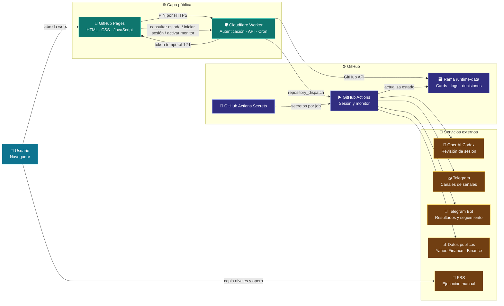
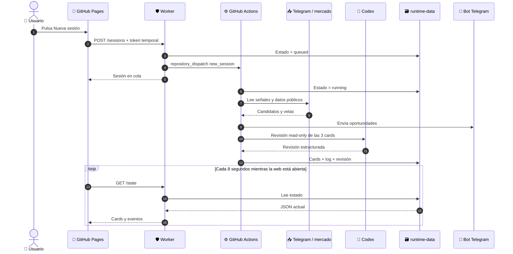
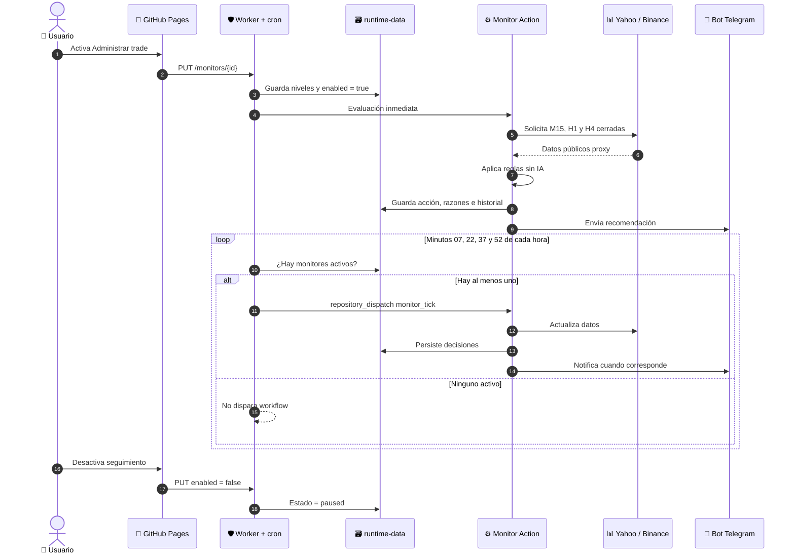
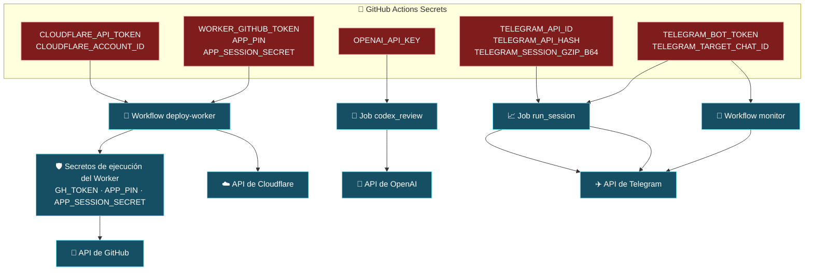
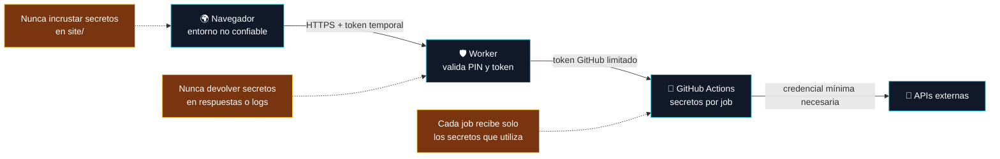
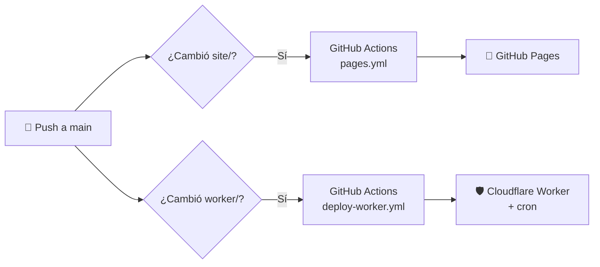

# Arquitectura visual de Trading Control

Esta documentación describe lo que está desplegado actualmente. El sistema genera recomendaciones y seguimiento, pero **nunca ejecuta ni modifica órdenes en FBS**.

## Vista general

### Responsabilidad de cada componente

| Componente | Qué hace | Qué no hace |
| --- | --- | --- |
| GitHub Pages | Presenta el panel, cards, log y controles. Guarda localmente la URL del Worker y el token temporal. | No contiene secretos ni ejecuta análisis. |
| Cloudflare Worker | Valida el PIN, firma sesiones de 12 horas, lee/escribe el estado y dispara workflows. Ejecuta el cron cada 15 minutos. | No recibe claves de OpenAI o Telegram y no analiza el mercado. |
| GitHub Actions | Ejecuta la sesión de trading, Codex, el monitor determinista y la publicación a Telegram. | No mantiene un servidor encendido. Cada ejecución es aislada. |
| Rama `runtime-data` | Conserva cards, eventos, monitores y decisiones entre ejecuciones. | No guarda API keys, el PIN ni sesiones de Telegram. |
| FBS | Es donde el usuario confirma precios y opera manualmente. | La web no se conecta a la cuenta ni toca órdenes. |

## Recorrido de una nueva sesión

Si Codex no está disponible, se publican igualmente los resultados deterministas del analizador; la sesión no queda bloqueada.

## Recorrido del seguimiento de un trade

La primera evaluación comienza al activar el switch. El cron posterior está alineado a minutos fijos, por lo que la primera espera puede ser menor de 15 minutos. El monitor puede decidir `MANTENER`, `MOVER_SL`, `AJUSTAR_TP`, `CERRAR_TODO` o `EVIDENCIA_INSUFICIENTE`. Toda acción debe confirmarse en FBS.

## Dónde vive y se usa cada secreto

| Nombre | Se guarda en | Se entrega a | Uso exacto | ¿Llega al navegador? |
| --- | --- | --- | --- | --- |
| `APP_PIN` | GitHub Actions Secrets y, tras desplegar, Cloudflare Worker Secrets | Worker | Comparar el PIN enviado por el usuario. | El usuario lo escribe; no se guarda en la web. |
| `APP_SESSION_SECRET` | GitHub Actions Secrets y Cloudflare Worker Secrets | Worker | Firmar y validar tokens temporales de 12 horas. | No. |
| `WORKER_GITHUB_TOKEN` | GitHub Actions Secrets; se copia como `GH_TOKEN` a Cloudflare | Worker | Leer/escribir `runtime-data` y disparar workflows mediante GitHub API. | No. |
| `CLOUDFLARE_API_TOKEN` | GitHub Actions Secrets | Workflow `deploy-worker` | Publicar el Worker y sincronizar sus secretos. | No. |
| `CLOUDFLARE_ACCOUNT_ID` | GitHub Actions Secrets | Workflow `deploy-worker` | Elegir la cuenta Cloudflare de destino. | No. |
| `OPENAI_API_KEY` | GitHub Actions Secrets | Job `codex_review` | Ejecutar `gpt-5.6-terra` con esfuerzo `medium`. | No. |
| `TELEGRAM_API_ID` | GitHub Actions Secrets | Job `run_session` | Autenticar el cliente que lee canales de señales. | No. |
| `TELEGRAM_API_HASH` | GitHub Actions Secrets | Job `run_session` | Completar la autenticación del cliente lector. | No. |
| `TELEGRAM_SESSION_GZIP_B64` | GitHub Actions Secrets | Job `run_session` | Reconstruir temporalmente `telegram-fbs.session`; se elimina con el runner. | No. |
| `TELEGRAM_BOT_TOKEN` | GitHub Actions Secrets | Job `run_session` y workflow `monitor` | Publicar oportunidades y decisiones de seguimiento. | No. |
| `TELEGRAM_TARGET_CHAT_ID` | GitHub Actions Secrets | Job `run_session` y workflow `monitor` | Definir el chat o canal receptor. | No. |

`GITHUB_TOKEN` es distinto de `WORKER_GITHUB_TOKEN`: GitHub crea el primero automáticamente para cada job y lo limita mediante `permissions`. Se usa para actualizar `runtime-data` desde Actions y desaparece al terminar el job. El segundo debe existir fuera de Actions porque el Worker necesita llamar a GitHub mientras no hay ningún job ejecutándose.

## Variables públicas y de ejecución

Estas variables no son credenciales y pueden aparecer en configuración o logs.

| Variable | Valor actual o procedencia | Uso |
| --- | --- | --- |
| `TRADING_API_BASE` | `https://trading-control.daniel-serkin.workers.dev` | URL pública que GitHub Pages usa para llamar al Worker. |
| `DATA_BRANCH` | `runtime-data` | Rama donde el Worker lee y escribe el estado. |
| `ALLOWED_ORIGIN` | `*` | Orígenes aceptados por CORS. El PIN y el token temporal siguen protegiendo la API. |
| `GH_OWNER` | Se inyecta desde `github.repository_owner` | Propietario usado por el Worker al construir las rutas de GitHub API. |
| `GH_REPO` | Se inyecta desde el nombre del repositorio | Repositorio usado por el Worker. |
| `GITHUB_REPOSITORY` | GitHub la crea automáticamente | Identifica `owner/repo` dentro de los scripts de Actions. |
| `RUNTIME_BRANCH` | Opcional; por defecto `runtime-data` | Permite cambiar la rama de estado en los scripts. |
| `SESSION_DATE` | Fecha UTC de cada ejecución | Ubicación temporal de los artefactos de sesión. |

## Límites de confianza

La rama `runtime-data` no contiene secretos, pero en un repositorio público sí permite ver símbolos, niveles y decisiones. Para ocultar también esa información habría que volver privado el repositorio o migrar el estado a almacenamiento privado.

## Despliegue

- Panel: <https://danielserkin.github.io/trading/>
- API del Worker: <https://trading-control.daniel-serkin.workers.dev>
- Salud del Worker: <https://trading-control.daniel-serkin.workers.dev/health>
